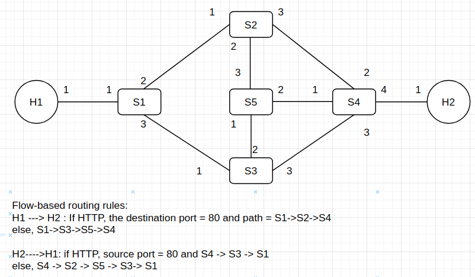
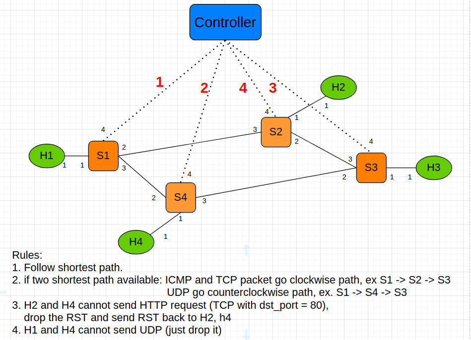

# CloudComputing
## Introduction
This repository is inspired by ECE6363 Cloud Computing class in NYU.  
I just want to create this repository to update what I've learned from the class and try to understand more details about how the network work in the world.

## Installation
1. need to under Ubuntu enviroment.
2. Install mininet through apt-get
   ```
   sudo apt-get update
   sudo apt-get install mininet
   ```
3. Install default [ovs controller](http://manpages.ubuntu.com/manpages/trusty/man8/ovs-controller.8.html)
   ```
   sudo apt-get install openvswitch-testcontroller
   sudo cp /usr/bin/ovs-testcontroller /usr/bin/ovs-controller
   ```
4. Install [RYU](https://github.com/faucetsdn/ryu)
   ```
   pip3 install RYU  
   or 
   sudo apt install python3-ryu #(for Ubuntu 20.04)
   ```


## Examples


Fig 1. Lab2 pre-defined topology. In this example, I implemented dataplane control rules [here](https://github.com/YaoChungLiang/CloudComputing/blob/main/lab2/lab2_rule.sh).


Fig 2. Lab3 pre-define topology. In this example, I implemented controller plane rule [here](https://github.com/YaoChungLiang/CloudComputing/blob/main/lab3/myController.py).


## Tips
You can use `xterm` to open terminal on certain node like Host1 thus you can send some TCP or UDP packet to another host.


